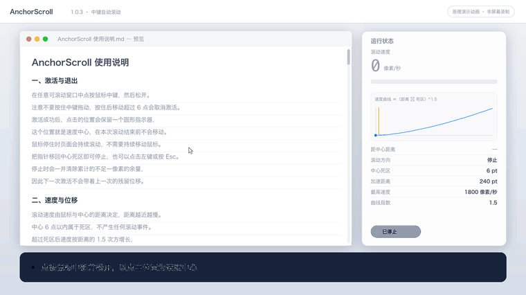

# AnchorScroll

macOS 菜单栏中键自动滚动工具 · Apple Silicon · macOS 14 及以上

[](LICENSE)
[-orange.svg)](CHANGELOG.md)
[](#系统要求)


---

## 演示



> 上图为**原理演示动画**，由仓库脚本 [`scripts/make-demo.py`](scripts/make-demo.py) 依据
> [`Sources/Core.swift`](Sources/Core.swift) 的速度曲线与 [`Sources/Indicator.swift`](Sources/Indicator.swift)
> 的指示器形状逐帧渲染，**不是屏幕录制**。完整版：[`docs/demo/anchorscroll-demo.mp4`](docs/demo/anchorscroll-demo.mp4)

---

## 项目定位与版本

AnchorScroll 是一款独立的 macOS 菜单栏中键自动滚动工具，使用 Swift、AppKit、SwiftUI 和 CoreGraphics 编写，
不依赖 Mac Mouse Fix、MiddleClickScroll 或 Scrollapp。当前应用版本 **1.0.3**，构建号 **4**，以预发布版交付。

目标操作是点按中键并松开，以点击位置为速度中心，鼠标移得近则慢、移得远则快，停在偏移位置持续滚动，
回到中心停止。点击鼠标或按 Esc 退出。

> 该工具还原的是 Windows 中键自动滚动的操作手感，**不对应“对所有应用完美复刻”的承诺**，
> 各应用的实际表现仍需逐一实测。

## 下载与安装

从 [Releases](../../releases) 下载安装镜像：

| 文件 | 用途 |
| --- | --- |
| `AnchorScroll-1.0.3-macOS-arm64.dmg` | 安装镜像，内含应用与「应用程序」快捷方式 |
| `AnchorScroll-1.0.3-macOS-arm64.zip` | 免安装压缩包，解压后得到 `AnchorScroll.app` |
| `SHA256SUMS.md` | 上述文件的 SHA-256 校验值 |

安装步骤：

1. 打开 DMG，将 `AnchorScroll.app` 拖入「应用程序」文件夹。
2. 打开应用，按提示前往 **系统设置 → 隐私与安全性 → 辅助功能** 勾选 AnchorScroll。
3. 若换版本后权限失效，请在辅助功能列表中移除旧条目，重新添加当前应用，
   然后重启应用或点击菜单栏中的「权限检查／重试」。

**首次打开提示**：本应用为本机 ad-hoc 签名，未使用 Developer ID 签名、未经 Apple 公证。
首次打开时 macOS 可能提示「无法验证开发者」，请**右键点击应用图标选择「打开」**，
或在系统设置的「隐私与安全性」中点击「仍要打开」。请勿通过关闭系统安全功能来安装。

## 使用方法

打开长文档，点按并松开中键，再上下移动鼠标。不要按住中键拖动；按住移动超过 6 点会取消本次激活。
普通转动滚轮不由 AnchorScroll 改写。

浏览器链接采用 Command＋左键在普通新标签页打开。Option＋中键仍原样透传；
在新版 Chrome／Edge 中可能触发拆分视图，不建议用它打开链接。程序没有把 Option＋中键重映射为普通中键。

## 设置与实现

菜单栏设置包括启用／暂停、灵敏度、最高速度、方向反转、横向滚动、登录启动、应用排除、普通滚轮模式及恢复默认手感。
默认上下方向不反转；恢复默认手感会保留方向选择。

默认中心停止区 6 点，最高速度 1800 像素／秒，加速距离 240 点，指数 1.5。
活动时以 120 Hz 调度，按实际经过时间计算位移并累计不足一像素的余量；每次最多使用 50 毫秒的时间步长，
回中心和反向时清除旧余量。

速度按启动锚点计算，实际滚动事件在 HID 层发送，使用当前真实指针位置，避免把指针拉回锚点。
滚动区域随指针所在区域变化，跨出文档可能改为滚动侧栏。切换前台应用、睡眠、显示布局变化或监听异常时取消自动滚动。

速度曲线定义在 [`Sources/Core.swift`](Sources/Core.swift) 的 `ScrollTuning.speed(_:)`：

```
excess   = max(0, |distance| - deadZone)
fraction = min(excess * sensitivity / fullDistance, 1)
speed    = sign(distance) * maxSpeed * fraction ** exponent
```

## 系统要求

* Apple Silicon（arm64）。**没有制作 Intel 通用二进制，也没有验证 Intel 支持。**
* macOS 14 或更新版本。
* 运行期无第三方依赖。

## 从源码构建

构建需要 Xcode Command Line Tools。

```bash
# 运行内核测试并生成 dist/AnchorScroll.app（含 ad-hoc 签名与严格校验）
bash build.sh

# 生成可分发的安装镜像 release/AnchorScroll-1.0.3-macOS-arm64.dmg
bash make-dmg.sh
```

* 可用 `ANCHORSCROLL_APP_OUTPUT` 指定 `.app` 输出位置；不要指向正在运行的安装版。
* 可用 `ANCHORSCROLL_DMG_OUTPUT` 指定 `.dmg` 输出位置。
* `make-dmg.sh` 会在打包后挂载镜像，核对应用、`Applications` 快捷方式、版本号与签名，
  校验通过才输出最终文件。

生成演示动画（需要 Pillow 与 ffmpeg）：

```bash
python3 scripts/make-demo.py --outdir docs/demo
```

## 仓库结构

```
AnchorScroll/
├── Sources/            应用源码
│   ├── Core.swift          速度曲线、位移积分、点击状态机
│   ├── EventController.swift 系统事件监听与调度
│   ├── Settings.swift      配置与设置界面
│   ├── Indicator.swift     中心指示器
│   ├── App.swift           菜单栏与启动
│   └── TestWindow.swift    原生滚动测试窗口
├── Tests/              内核断言与浏览器测试页面
├── Resources/          应用图标（.icns）
├── assets/             图标源文件与文档配图
├── docs/               项目文档与演示素材
├── scripts/            演示动画生成脚本
├── release/            可分发安装包与校验值
├── build.sh            构建应用
└── make-dmg.sh         生成安装镜像
```

## 测试状态与已知限制

2026 年 9 月 10 日发布整理时重新构建，内核及点击状态机共 **286 条断言通过**，其中包含 240 个距离采样点。
数量不代表 286 个独立应用场景。**源码可构建和签名校验通过均不等于真实鼠标手感通过。**

1.0.1 曾在原生测试窗口取得慢速、快速和停止数据，但后来真实用户操作发现指针会跳回中心。
最小事件探针复现了固定坐标 HID 事件改变真实指针的原因；1.0.2 已改为当前指针位置，1.0.3 保留该修复并增加方向开关。

最新保留的 1.0.3 GUI 集成测试结果为 **blocked**（当时缺少辅助功能授权）。
授权可能后来变化，但没有新的完整通过报告，因此当前版本真实手感、浏览器／WPS／Obsidian／预览／Finder／微信／Codex、
多屏、嵌套区域及长时间运行**均不得记为全部验收通过**。

Mos 曾与事件输出发生冲突，目前选择暂时退出 Mos 并保留其软件与配置。兼容性仍需实测；
不要卸载旧工具或修改其他鼠标驱动配置来掩盖问题。

本机构建成功也不等于另一台 Mac 可免提示启动；对外下载后的 Gatekeeper、辅助功能和登录启动体验需要在干净环境验收。

当前程序**不访问网络、不记录键盘文字、不部署额外后台服务**。

详见 [`docs/TEST_STATUS.md`](docs/TEST_STATUS.md) 与 [`docs/validation.json`](docs/validation.json)。

## 许可证

本项目使用 **MIT License**，详见 [`LICENSE`](LICENSE)。

图标为本项目自行生成的素材，不是 Apple 官方图标，也不表示 Apple 的任何背书。
